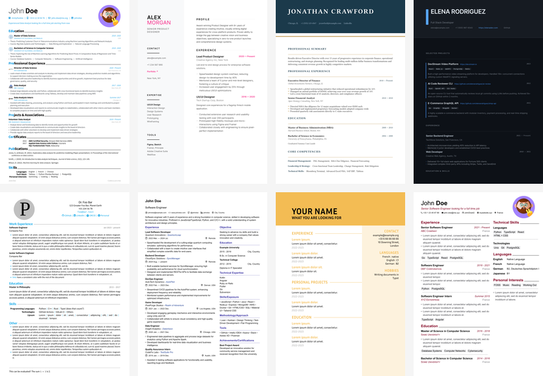

# AeroCV - Multi-Template Typst Resume Generator



A professional CV/Resume and Cover Letter generator using **Typst** with **9 templates**. Designed for use with **local coding agents** (Claude Code, Qwen Code, Cline, Roo Code, Kilo) and **cloud GPT agents**.

## Quick Start

### For Local Coding Agents

1. **Read `AGENTS.md`** — full agent setup guide for all popular tools
2. **Read `quick_reference.json`** — discover available templates
3. **Read `SYSTEM_PROMPT_CODE_AGENTS.md`** — compilation instructions & code examples
4. **Compile**: `typst compile --font-path templates/<id>/fonts <file>.typ output_pdfs/<output>.pdf`

### For GPT / Cloud Agents

Try it instantly: [AeroCV on ChatGPT](https://chatgpt.com/g/g-69b6fdb57ef081918831daa7673cb131-aerocv-ats-resume-cover-letter-pdf-maker)

1. **Read `quick_reference.json`** — discover available templates
2. **Read `templates_registry.json`** — get detailed template info
3. **Follow `SYSTEM_PROMPT_TYPST.md`** — compilation instructions
4. **Build agent packs**: `python scripts/pack_per_template.py`

### Minimal Example (brilliant-cv)

```bash
# Windows
$env:XDG_DATA_HOME = "$PWD\packages"
typst compile --font-path templates\brilliant-cv\fonts my_resume.typ output_pdfs\my_resume.pdf

# Linux/macOS
export XDG_DATA_HOME="$PWD/packages"
typst compile --font-path templates/brilliant-cv/fonts my_resume.typ output_pdfs/my_resume.pdf
```

## 📋 Available Templates

### Resume Templates

| ID | Name | Style | Best For | Cover Letter | Photo | Preview |
|----|------|-------|----------|--------------|-------|---------|
| `modern-cv` | Modern CV | Professional | Tech, Corporate | ✅ | ✅ Circular | [Preview](template_images/resumes/modern-cv-preview.png) |
| `typst-cv` | Typst CV | Simple | General | ❌ | ✅ Rectangular | [Preview](template_images/resumes/typst-cv-preview.png) |
| `brilliant-cv` | Brilliant CV | Modern | Multi-language | ✅ | ✅ Configurable | [Preview](template_images/resumes/brilliant-cv-preview.png) |
| `vercanard` | VerCanard | Minimal | Single-page | ❌ | ❌ | [Preview](template_images/resumes/vercanard-preview.png) |
| `vantage` | Vantage | Clean | Tech | ❌ | ❌ | [Preview](template_images/resumes/vantage-preview.png) |
| `neat-cv` | Neat CV | Bilingual | EN/FR | ✅ | ✅ Left side | [Preview](template_images/resumes/neat-cv-preview.pdf) |
| `designer-cv` | Designer CV | Creative | High-end Design | ✅ | ✅ Circular | [Preview](template_images/resumes/designer-cv-preview.png) |
| `executive-cv` | Executive CV | Formal | Execs, Academics | ✅ | ✅ Strict right | [Preview](template_images/resumes/executive-cv-preview.png) |
| `portfolio-cv` | Portfolio CV | Technical | Devs, Artists | ✅ | ✅ Rounded | [Preview](template_images/resumes/portfolio-cv-preview.png) |

### Template Details

#### Modern CV (`modern-cv`)
- **Source**: [ptsouchlos/modern-cv](https://github.com/ptsouchlos/modern-cv)
- **Features**: Clean design, FontAwesome icons, 35+ languages
- **Fonts**: Source Sans 3, Roboto
- **Packages**: fontawesome, linguify

#### Typst CV (`typst-cv`)
- **Source**: [JCGoran/typst-cv-template](https://github.com/JCGoran/typst-cv-template)
- **Features**: Simple, customizable via TOML
- **Fonts**: System fonts
- **Packages**: None

#### Brilliant CV (`brilliant-cv`)
- **Source**: [yunanwg/brilliant-CV](https://github.com/yunanwg/brilliant-CV)
- **Features**: ATS-friendly, modular, multi-language
- **Fonts**: Roboto, Inter, Source Sans
- **Packages**: fontawesome, tidy

#### VerCanard (`vercanard`)
- **Source**: [elegaanz/vercanard](https://github.com/elegaanz/vercanard)
- **Features**: Minimalist, single-page
- **Fonts**: System fonts
- **Packages**: vercanard (self-contained)

#### Vantage (`vantage`)
- **Source**: [sardorml/vantage-typst](https://github.com/sardorml/vantage-typst)
- **Features**: Clean layout, SVG icons
- **Fonts**: System fonts
- **Packages**: None

#### Neat CV (`neat-cv`)
- **Source**: [UntimelyCreation/typst-neat-cv](https://github.com/UntimelyCreation/typst-neat-cv)
- **Features**: Bilingual (EN/FR), content separation
- **Fonts**: Source Sans Pro (included)
- **Packages**: None

#### Designer CV (`designer-cv`)
- **Source**: Custom Built
- **Features**: Visually striking, creative 2-column layout, stylized typography
- **Fonts**: Inter, Outfit
- **Packages**: None

#### Executive CV (`executive-cv`)
- **Source**: Custom Built
- **Features**: Restrained, highly structured, minimal colors, strict ATS layout
- **Fonts**: Times New Roman
- **Packages**: None

#### Portfolio CV (`portfolio-cv`)
- **Source**: Custom Built
- **Features**: Dedicated project sections, prominent portfolio links, modern header
- **Fonts**: Roboto, Montserrat
- **Packages**: None

## Project Structure

```
AeroCV/
├── templates/                    # Template storage
│   └── <id>/
│       ├── source/               # Template source files
│       ├── fonts/                # Font files
│       └── packages/             # Typst packages (if needed)
│
├── cover_letters/                # Cover letter templates
├── template_images/              # Preview images
├── scripts/                      # Build & test scripts
├── schemas/                      # JSON schemas
├── docs/                         # Documentation
│   ├── ATS_GUIDELINES.md
│   ├── ROADMAP.md
│   └── PHOTO_QUICK_REF.md
│
├── output_pdfs/                  # ⬅️ Generated PDFs (gitignored)
├── packages/                     # Shared Typst packages (fontawesome, linguify)
│
├── AGENTS.md                     # 🤖 Agent setup guide (READ THIS FIRST)
├── SYSTEM_PROMPT_CODE_AGENTS.md  # 🖥️ Prompt for local code agents (Claude Code, Qwen Code, etc.)
├── SYSTEM_PROMPT_TYPST.md        # ☁️ Prompt for chat/cloud models (GPT, Gemini)
├── templates_registry.json       # Machine-readable template catalog
├── quick_reference.json          # Abbreviated template info
└── README.md                     # This file
```

## Key Files

| File | Purpose |
|------|---------|
| `AGENTS.md` | Agent setup guide for all local coding agents |
| `SYSTEM_PROMPT_CODE_AGENTS.md` | Template syntax, code examples & compilation for local code agents |
| `SYSTEM_PROMPT_TYPST.md` | Template syntax, code examples & compilation for chat/cloud models |
| `quick_reference.json` | Quick template discovery (machine-readable) |
| `templates_registry.json` | Full template registry with paths |
| `schemas/*.schema.json` | JSON schema validation |
| `docs/ATS_GUIDELINES.md` | ATS compatibility guide |
| `docs/ROADMAP.md` | Template creation roadmap |
| `docs/PHOTO_QUICK_REF.md` | Profile photo quick reference |

## Profile Photo Support

Several templates support including a professional profile photo. When using a compatible template, the AI agent will ask if you'd like to include one.

### Supported Templates
- **Modern CV**: Circular photo in the header.
- **Typst CV**: Rectangular photo.
- **Brilliant CV**: Configurable placement.
- **Neat CV**: Left-side sidebar photo.

### How to Use
1. **Upload**: Provide a PNG or JPG file (min 200x200px recommended).
2. **Confirm**: The agent will detect the photo and ask for confirmation.
3. **Generate**: The photo will be integrated into the final PDF.

For technical implementation details, see [docs/PHOTO_QUICK_REF.md](docs/PHOTO_QUICK_REF.md).


## Local Agent Integration

See **[AGENTS.md](AGENTS.md)** for detailed setup instructions for:

- **Claude Code** (Anthropic CLI)
- **Qwen Code** (Qwen CLI)
- **Cline / Roo Code** (VS Code extensions)
- **Continue** (VS Code extension)
- **Kilo** (CLI)

All agents should read `SYSTEM_PROMPT_CODE_AGENTS.md` (local agents) or `SYSTEM_PROMPT_TYPST.md` (cloud agents) before generating any `.typ` code. Output PDFs to `output_pdfs/`.

## Supported Languages

35+ languages including: English, Russian, German, French, Spanish, Italian, Portuguese, Dutch, Polish, Chinese, Japanese, Korean, Arabic, Hindi, Turkish, and more.

## ATS Compatibility

All templates follow ATS best practices:
- ✅ Semantic headings
- ✅ Grid-based layouts (no absolute positioning)
- ✅ Standard section names
- ✅ Embedded fonts
- ✅ Clean text extraction

See [docs/ATS_GUIDELINES.md](docs/ATS_GUIDELINES.md) for details.

## Scripts

| Script | Purpose |
|--------|---------|
| `scripts/test_all_templates.py` | Compile every template and report success/failure |
| `scripts/pack_per_template.py` | Build per-template ZIPs for cloud GPT agents |
| `scripts/pack_agent_zip.py` | Build combined agent data ZIP |
| `scripts/build_typst_template.py` | Build typst template assets |
| `scripts/update_jsons.py` | Update registry JSON files |

## 📝 License

- **Modern CV**: MIT License (Paul Tsouchlos)
- **Brilliant CV**: MIT License
- **Typst CV**: MIT License
- **VerCanard**: MIT License
- **Vantage**: MIT License
- **Neat CV**: MIT License
- **Project Structure & Custom Templates (`designer-cv`, `executive-cv`, `portfolio-cv`)**: Functional Source License (Non-Compete) - See LICENSE file.

## 🙌 Credits & Original Templates

This project builds upon the fantastic work of the open-source Typst community. Credit to the original template creators:
1. **Typst CV**: [JCGoran/typst-cv-template](https://github.com/JCGoran/typst-cv-template)
2. **Brilliant CV**: [yunanwg/brilliant-CV](https://github.com/yunanwg/brilliant-CV)
3. **VerCanard**: [elegaanz/vercanard](https://github.com/elegaanz/vercanard)
4. **Vantage**: [sardorml/vantage-typst](https://github.com/sardorml/vantage-typst)
5. **Neat CV**: [UntimelyCreation/typst-neat-cv](https://github.com/UntimelyCreation/typst-neat-cv)

## 🔗 Links

- [Typst Documentation](https://typst.app/docs/)
- [Typst Templates](https://typst.app/templates)
- [Typst Universe](https://typst.app/universe)
